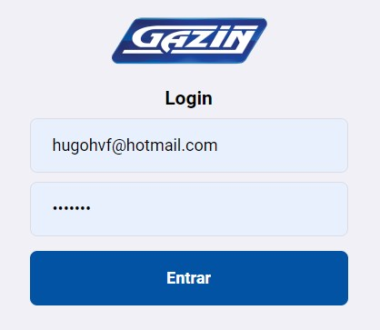
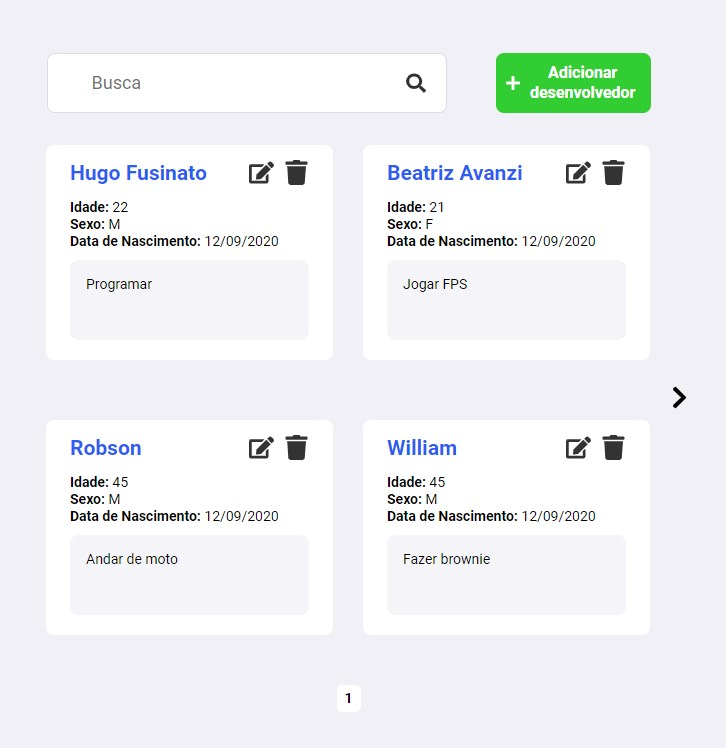

# CRUD Gazin

## Descrição

  Aplicação do processo seletivo Gazin com API REST com uso de Node.Js e FrontEnd com uso de React.Js

  

  

## Tabela de conteúdos
   * [Descrição](#descrição)
   * [Funcionalidades](#funcionalidades)
   * [Pré-Requesitos](#pré-requisitos)
   * [Funcionamento](#funcionamento)
   * [Testes](#testes)
   * [Autor](#autor)

## Funcionalidades

  * Autenticação JWT
  * Adicionar desenvolvedor
  * Editar desenvolvedor
  * Deletar desenvolvedor
  * Listar todos desenvolvedores
  * Listar todos desenvolvedores por página e query params
  * Página Web que consuma todas estas rotas
  * Padrões UI/UX

## Pré-Requisitos

* Instalar o [Docker Desktop](https://docs.docker.com/get-docker/).

* Ter o [MongoDB](https://docs.mongodb.com/manual/installation/) rodando no sistema (Community Edition - Versão Server)

## Funcionamento

### Docker

Caso a porta 3000 (React) e 3333 (Node API) esteja livre apenas rode o comando na raiz:

    docker-compose up -d --build

### Local

Basta rodar o servidor

    cd ./server/
    npm start

E o React

    cd ./web/
    npm start

### Acesso

Rotas de acesso podem ser consultadas na [documentação do CRUD](https://github.com/nelsonptobias/pontential-crud)

Servidor web rodando em http://localhost:3000

### Autenticação

Para obter acesso na rota pode usar qualquer usuário e senha na rota /token com o objeto JSON

POST /token

    {
      "username": "usuario",
      "password": "123"
    }

O Login web tbm aceita qualquer usuário e senha. Criado como conceito para uso de autenticação com JWT

## Testes

Para rodar todos os testes basta usar os comandos:

    cd ./server/
    npm test

## Autor

* **Hugo Fusinato**: @hugohvf (https://github.com/hugohvf)
* 